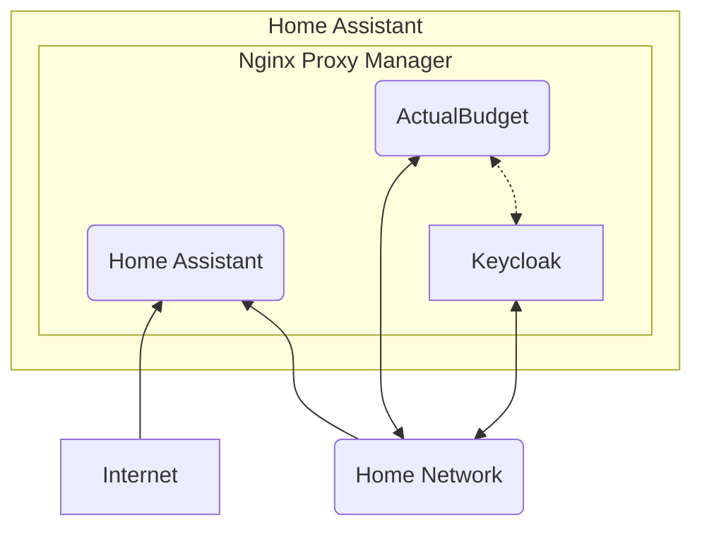

# Keycloak for Home assistant
#### This is a self-made addon to enable keycloak for Home Assistant

>[!WARNING] 
> <h3>Do not use this as OpenID provider for Home Assistant self.</h3>
> Since this is an addon for home assistant that handles authentication, it should not be in lead of authentication to home assistant. Falsely configurations can lead to permanent lockout of Home Assistant. Therefor use this addon only for other addons that might require an openID solution. 
> Do not use this as an OpenID for Home Assistant by itself, only for other addons that support OpenId.

# Installation

Add the addon through the following button:

This will add this repository in your addons list.

## Before first run.

In the config you can alter the first-time use username and password this is used to create a default user so you can login and setup the environment of keycloak

After initializing please remove this user and use your own. 

By Default the username is filled with admin/admin. **This is a security risk, so therefor you can alter it before keycloak is initialized.**
After initializing please go to the local ipaddress of home assistant and use the port described in the config file to adjust the admin user.

### Examples of configuration with ActualBudget

In this section I will explain how I use Keycloak, and how you might use it too.

The app that I will use is [ActualBudget](https://actualbudget.org/), this is a finance app that you can host on Home Assistant ([Addon page](https://github.com/sztupy/hassio-actualbudget)) . And it has OpenId as an authentication method.

The ActualBudget app can be replaced with any of your own apps, except for Home Assistant itself!

In the diagram here you see the network setup, Nginx exposes Home Assistant but not the other apps, even though an app might need openId, we can use Keycloak here. But also in this situation, keycloak is not exposed to the web.

